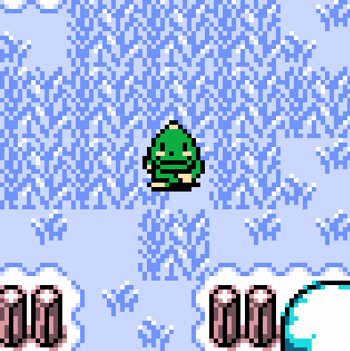
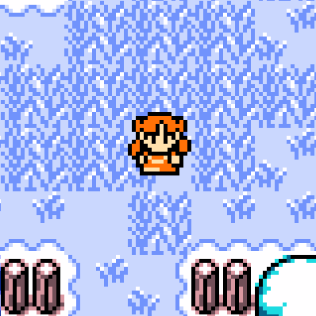
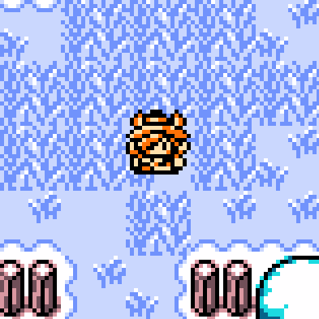
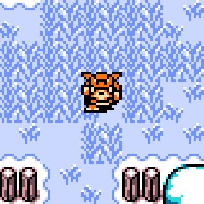
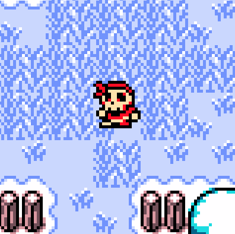
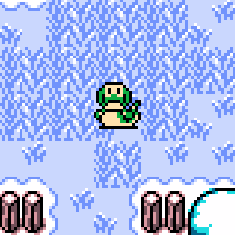
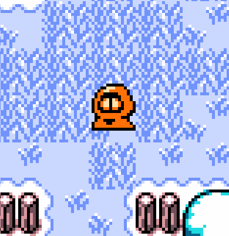
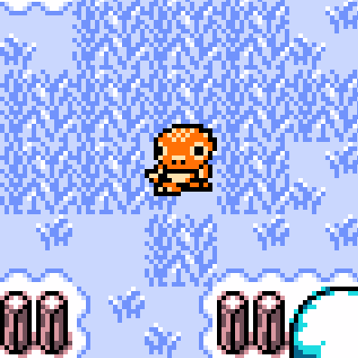
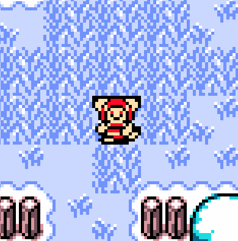
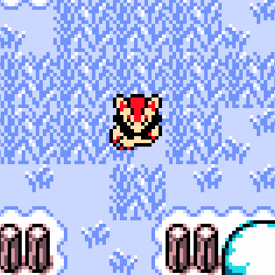

# Sprites for Archipelago implementation of "Zelda Oracle" games

## Instructions

To use:
- Download the .bin file of the sprite(s) you want to use and place them in your `Archipelago/data/sprites/oos_ooa` folder
  - You may need to create this folder first
- Follow the [Archipelago guide](https://github.com/Dinopony/ArchipelagoOoS/blob/oos/worlds/tloz_oos/docs/oos_setup_en.md#setting-up-cosmetic-options-sprite-palette) to set the sprite and palette you prefer

To create:
- In the Archipelago Launcher select "TLOZ Oracle sprite editor" (requires the Seasons or Ages apworld to be installed)
- Click "Load Link", then "Export Image". This will create a template sprite sheet to reference or edit
  - If you wish to toggle the separator between sprites or change the color palette before or during editing, click "Switch Separator" or "Switch Palette", before exporting
- Open the exported .bmp file in your image editor of choice and create your sprite sheet
- Back in the TLOZ Oracle sprite editor, click "Load Sprite..." and select the new sprite sheet
- Choose the color palette you wish to use, and click "Select sprite for [game]"
  - This will automatically create a .bin file, place it in your `Archipelago/data/sprites/oos_ooa` folder, and set the sprite and palette in your host.yaml for the chosen game
  - If you wish to create the .bin but not use it, instead click "Export Binary" and place it in your `Archipelago/data/sprites/oos_ooa` folder
    - You may need to create this folder first

To edit:
- Download the .bmp file of the sprite you want to edit, and open it in your image editor of choice
  - If you wish to toggle the separator between sprites or change the color palette before or during editing, follow the next step and click "Switch Separator" or "Switch Palette", then "Export Image" and use the new .bmp to edit
- In the Archipelago Launcher select "TLOZ Oracle sprite editor" (requires the Seasons or Ages apworld to be installed)
- Click "Load Sprite..." and select the edited sprite sheet
- Choose the color palette you wish to use, and click "Select sprite for [game]"
  - This will automatically create a .bin file, place it in your `Archipelago/data/sprites/oos_ooa` folder, and set the sprite and palette in your host.yaml for the chosen game
  - If you wish to create the .bin but not use it, instead click "Export Binary" and place it in your `Archipelago/data/sprites/oos_ooa` folder
    - You may need to create this folder first

## [Ganondorf](./ganondorf)

Contributed by Snowroark

## [Goron](./goron)

Contributed by Snowroark

## [Marin](./marin)

Contributed by Stewmat

## [Matty](./matty)

Contributed by Madam Materia

## [Moblin](./moblin)

Contributed by SiegRich

## [Piratian](./piratian)

Contributed by Snowroark

## [Rope](./rope)

Contributed by FerreTrip

## [Subrosian](./subrosian)

Contributed by Snowroark

## [Tokay](./tokay)

Contributed by Snowroark

## [Vulpera](./vulpera)

Contributed by ShugoWah

## [Zoroark](./zoroark)

Contributed by Snowroark

